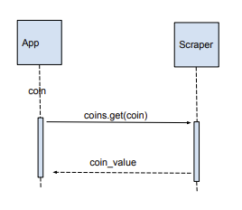

<h1 align="center"> Crypto Currency Microservice </h1>
<!-- OVERVIEW -->
<h2 id="overview"> :cloud: Overview</h2>

 
  In this microservice, contains a Web Scraper that scrapes live Crypto Prices. ZeroMQ is utilized to communicate from a send and receive point.

<!-- PROJECT FILES DESCRIPTION -->
<h2 id="project-files-description"> :floppy_disk: Project Files Description</h2>

<ul>
  <li><b>scraper.py</b> - Web scraper for Crypto Currency prices</li>
  <li><b>receive.py</b> - Receive file  </li>
  <li><b>send.py</b> - Send file </li>
</ul>

<!-- GETTING STARTED -->
<h2 id="getting-started"> :book: Getting Started</h2>
You will need to install BeautifulSoup, zmq, and the requests library.

Mac:
<pre><code>$ pip install beautifulsoup4</code></pre>
<pre><code>$ pip install zmq</code></pre>
<pre><code>$ pip install requests</code></pre>

Windows:
<pre><code>$ python3 -m pip install beautifulsoup4</code></pre>
<pre><code>$ python3 -m pip install zmq</code></pre>
<pre><code>$ python3 -m pip install requests</code></pre>

Begin with running the receive file

<pre><code>$ python3 receive.py</code></pre>

Then, start the send file followed with your desired Crypto Currency. For example:

<pre><code>$ python3 receive.py</code></pre>
<pre><code>$ BTC</code></pre>
<b> Output </b>
<pre><code>$ 20,593.90 </code></pre>
<b> UML Sequence Diagram </b>

